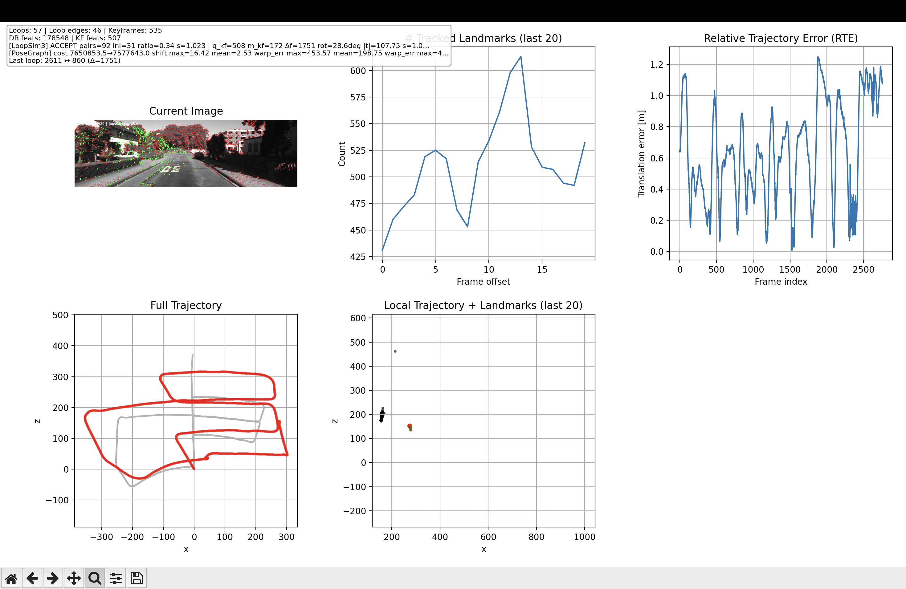
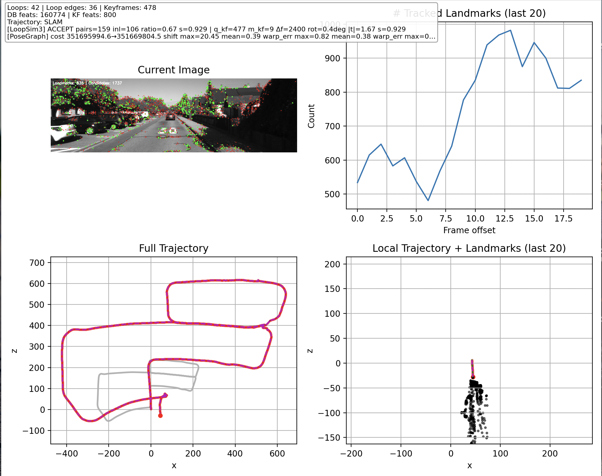

# Monocular Visual Odometry with Bundle Adjustment & Loop Closure

A full monocular visual SLAM pipeline built for the ETH **Vision Algorithms for Mobile Robotics (VAMR)** course, taught by Prof. Davide Scaramuzza's Robotics & Perception Group. Tracks camera pose from a single image stream on the KITTI, Malaga and Parking datasets, with optional **local bundle adjustment**, **SIFT-based loop closure** with Sim(3) pose-graph optimization, and **ground-plane scale correction**.

<p align="center">
  
  <br/>
  <em>KITTI 00 — the running VO pipeline. With KLT tracking and PnP only (no loop closure, no ground-plane scale correction yet), the trajectory exhibits the characteristic <b>monocular scale drift</b> that motivates the rest of the pipeline.</em>
</p>

### Full pipeline running end-to-end (40× sped-up)

<p align="center">
  
  <br/>
  <em>The same VO pipeline with <b>KLT tracking + local bundle adjustment</b> running on the full KITTI 00 sequence — the original ~20-minute screen recording compressed to 30 seconds.</em>
</p>

---

## What it does

Given a calibrated monocular image sequence, the pipeline:

1. **Bootstraps** an initial map by matching two well-separated frames, recovering relative pose via the 5-point essential matrix (RANSAC), and triangulating an initial set of 3D landmarks.
2. **Tracks** features frame-to-frame using **KLT** (default — fast, geometrically clean) or **SIFT** (more robust to large motion, but slower), and estimates each new camera pose with **RANSAC PnP** against the current landmark set.
3. **Triangulates new landmarks** continuously, retiring stale ones, to keep the map size bounded.
4. *(optional)* Refines the most recent keyframes and landmarks with a **windowed local bundle adjustment** (Levenberg–Marquardt via `scipy.optimize.least_squares` with analytic Jacobians).
5. *(optional)* Detects **loop closures** with a SIFT bag-of-features place-recognition step, computes a Sim(3) measurement between the loop pair, runs a **pose-graph optimization** in Sim(3), and applies the resulting world warp to all landmarks and past poses — resetting the world frame consistently.
6. *(optional)* Recovers absolute scale on KITTI by fitting the dominant **ground plane** in the local landmark cloud and rescaling to the known camera height.

---

## Demos

| KITTI — pipeline incrementally improved | Loop closure correcting trajectory drift |
|---|---|
|  |  |
| Monocular VO with KLT + local BA on KITTI. | After SIFT-based place recognition triggers a Sim(3) loop closure, the pose-graph optimiser snaps both halves of the trajectory into alignment (here with the modified loop / odometry weights). |

---

## Pipeline architecture

The `src/` tree mirrors the major stages of the pipeline:

```
src/
├── initialization/         # Bootstrap from two frames
│   ├── initialization.py     - 5-point essential matrix + RANSAC + triangulation
│   ├── correspondences.py    - keypoint matching (KLT and SIFT variants)
│   ├── geometry.py           - epipolar geometry helpers
│   ├── structures.py         - CameraIntrinsics, VOInitializationResult
│   └── visualization.py      - 3D scene + correspondences plots
│
├── continuous_operation/   # Per-frame VO loop
│   ├── continuous_operation_klt.py   - KLT-based tracker (default)
│   ├── continuous_operation_sift.py  - SIFT-based tracker
│   ├── local_bundle_adjustment.py    - windowed LM bundle adjustment
│   ├── structure.py                  - VOState (landmarks, candidates, poses)
│   └── visualization.py
│
├── loop_closing/           # Place recognition + Sim(3) correction
│   ├── place_recognition.py  - SIFT BoF / vocabulary lookup
│   ├── loop_detector.py      - candidate filtering + geometric verification
│   ├── sim3.py / sim3_lie.py - Sim(3) parametrization
│   ├── pose_graph.py         - g2o-style pose-graph optimization
│   ├── trajectory_warp.py    - applies the optimised correction to all keyframes
│   ├── world_reset.py        - rebases the world frame after the warp
│   ├── correction.py         - composes the full correction pipeline
│   ├── keyframes.py          - sliding-window keyframe manager
│   └── feature_selection.py  - picks which features to track for LC
│
├── evaluation/             # Metrics
│   ├── metrics.py            - KITTI absolute / relative trajectory error
│   └── trajectory_error.py
│
├── ui_tools/               # Live visualization (matplotlib)
├── sift_mapping/           # Sparse SIFT map utilities
├── utils/
└── data_loader.py          - KITTI / Malaga / parking loaders
```

Four `main_*.py` entries let you toggle pipeline stages without touching the code:

| Entry point | Stages enabled |
|---|---|
| `python main.py` | Init + continuous VO (KLT) |
| `python main_with_ba.py` | Init + continuous VO + **local BA** |
| `python main_with_ground_scale.py` | Init + continuous VO + **ground-scale correction** (KITTI) |
| `python main_loop_closure.py` | **Full pipeline** — init + continuous VO + BA + loop closure + Sim(3) PGO + scale |

---

## Setup

Python **3.10** is recommended (the repo was developed on 3.10.18).

```bash
git clone https://github.com/fedecomi04/vamr-visual-odometry.git
cd vamr-visual-odometry

# Option A: conda
conda create -n vamr python=3.10 pip
conda activate vamr

# Option B: venv
python3.10 -m venv .venv
source .venv/bin/activate

pip install -r requirements.txt
```

### Datasets

The three supported datasets are not redistributed here — download them yourself and place each under `data/`:

| Dataset | Where to get it | Folder name |
|---|---|---|
| KITTI Odometry (greyscale, seq. 00–10) | https://www.cvlibs.net/datasets/kitti/eval_odometry.php | `data/kitti/` |
| Malaga Urban Extract 07 | https://www.mrpt.org/MalagaUrbanDataset | `data/malaga-urban-dataset-extract-07/` |
| Parking | Provided by the VAMR course | `data/parking/` |

---

## Running

```bash
# Full pipeline (loop closure + BA + ground scale) on KITTI 00
python main_loop_closure.py --dataset kitti

# Pure VO, no extras
python main.py --dataset malaga

# Parking sequence
python main.py --dataset parking
```

A live matplotlib window shows the current frame with tracked features, the 3D landmark cloud, the estimated trajectory, and (when enabled) the loop-closure correction in real time.

---

## Project background

This was the final project of **Vision Algorithms for Mobile Robotics (VAMR)** at ETH Zürich, Autumn 2025 — taught by Prof. Davide Scaramuzza's [Robotics & Perception Group](https://rpg.ifi.uzh.ch/). The full assignment specification is preserved at [`docs/project_statement.pdf`](docs/project_statement.pdf).

The course covers everything that goes into building this pipeline from scratch: image formation, feature detection (Harris/SIFT/SURF/ORB), descriptor matching, epipolar geometry, the 8-point and 5-point algorithms, RANSAC, triangulation, PnP, KLT tracking, stereo, bundle adjustment, place recognition and visual SLAM.

---

## Authors

Built in a three-person team:

- **Federico Cominelli** ([@fedecomi04](https://github.com/fedecomi04))
- **Jaeryeong (Nicole) Kim** ([@nicolejrkim](https://github.com/nicolejrkim))
- **Matteo Cozzi**

---

## License

Released under the **MIT License** — see [LICENSE](LICENSE).
